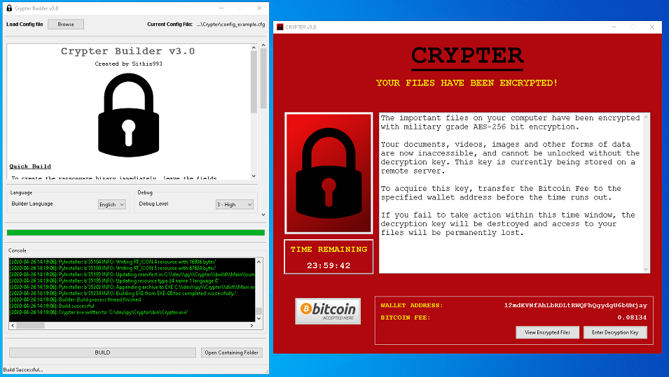

<h1 align="center">Crypter</h1>

     
    A Ransomware and Ransomware Builder for Windows written purely in Python

Created for security researchers, enthusiasts and educators, Crypter allows you to experience ransomware first hand. The newly released v3.0 is a complete overhaul that drastically simplifies setup and brings the package up-to-date to work with Python 3.6 and above. 

If you're looking to dive straight in then head to the section on <a href="#getting-started">Getting Started</a>. Otherwise continue reading to learn more about Crypter.

<b>Note: </b>By making use of this repository and/or the content within, you agree that you have read and accepted the terms of the <a href="#disclaimer">Disclaimer</a>

<h2 align="center">Contents</h2>

<!-- TOC depthFrom:2 depthTo:6 withLinks:1 updateOnSave:1 orderedList:0 -->
- [What's New](#whats-new-v30)
- [Disclaimer](#disclaimer)
- [Screenshots](#screenshots)
- [How Does it Work?](#how-does-it-work)
    - [Builder](#builder)
    - [Ransomware](#ransomware)
- [Getting Started](#getting-started)
- [FAQs](#faqs)
<!-- /TOC -->

<h2 align="center">What's New? (v3.0)</h2>
<ul>
    <li>Decryption key validation check before attempting decryption</li>
    <li>Overhaul to support Python 3.6 and above</li>
    <li>Drastically simplified dependency installation</li>
</ul>

<h2 align="center">Disclaimer</h2>

Crypter is intended for educational and research purposes only. This software should not be used within any system or network for which you do not have permission, nor should it be used for any illegal or illicit purposes. The author takes no responsibility for any damages that may be caused by the software in this repository.

Once compiled, Crypter WILL encrypt the files on the computer on which it is executed. Whilst Crypter provides you with access to the decryption key, enabling you to decrypt any encrypted files, bugs and other issues could, in theory, interrupt or prevent a successful decryption. Consequently, a permanent and irreversible loss of data could occur. To avoid any potential damage, <b>you should only run Crypter on a test machine created for this purpose</b>.

Once again,<b>the author accepts no responsibility for any damages that may occur, and by downloading this software you accept and agree to this disclaimer.</b>

<h2 align="center">Screenshots</h2>

     
    Builder application (left) for customising and building the Crypter Ransomware (right)

<h1 align="center">Getting Started</h1>
From version 3.0 onwards, getting started is now easier than ever:
  
<ol>
    <li>Download or clone this repository</li>
    <li>Install the dependencies by running <b>pip install -r requirements.txt</b></li>
    <li>Run Builder.pyw to open the Builder and start building!</li>
</ol>
It's really that simple.

<h2 align="center">How Does it Work?</h2>

### Builder
The builder is the application that allows you to customise and build the Crypter Ransomware. Some of the options you can set include:

- Binary Executable File Icon
- GUI Title/Heading
- GUI Font and Background Colour
- Bitcoin Wallet Address
- Ransom Fee
- Ransom Message
- Payment Time Limit 
- File Shadow Copy Deletion
- Filetypes to Encrypt

and many more. After setting these options simply hit the <b>BUILD</b> button the build the executable.

### Ransomware
Once executed, Crypter will take the following steps:

- Generate an AES-256 bit encryption/decryption key and write it to key.txt in the current directory
- Search relevant locations (network drives, user directories, etc.) for matching files
- Encrypt all matching files
- Display the Crypter GUI to the victim

<h2 align="center">FAQs</h2>

#### 1. Why did you create this?</li>

Crypter was created for two reasons:
    <ul>
        <li>As an experiment and Proof-of-Concept (PoC)</li>
        <li>For use in Red vs. Blue training environments</li>
    </ul>            

Traditionally, malware is written in compiled languages like C and C++. As a security researches and Python developer, I set out to determine the extent to which interpretted languages could be used for the creation of malware. At the same time I was working for a security reseller who offered Red vs. Blue training to large enterprises. The training environment made use of live malware samples which were realistic, but unreliable and volatile. After completing the initial PoC, I continued working on Crypter for this organisation to provide a customisable Ransomware sample for use use in this environment.

#### 2. Why make it publically available?

Crypter was made publically available to enable security researchers and enthusiasts to gain a better understanding of Ransomware. While there are plenty of guides and videos on the topic, they usually don't provide the understanding that can be gained by experiencing something first hand.

#### 3. But couldn't it be used by criminals for malicious purposes?!

While Crypter can be used to simulate a real Ransomware attack, steps have been taken to allow users to reverse any damage, and to prevent use by criminals in the wild. Ransomware is only useful to a criminal if they have the ability to decrypt the user's files and the user does not. Traditionally this is done by sending the encryption key to a remote Command & Control (CnC) server controlled by an attack once the user's files have been encrypted. The victim then pays a ransom fee to retrieve access to the key that will decrypt their files.

    With Crypter however, there is <b>no</b> inbuilt CnC capability. Once the user's files have been encrypted, the decryption key is written to <b>key.txt</b> in the same directory as the ransomware executable. The user can then use this key to decrypt their files.

#### 4. Could it not be adapted for malicious use?

    It is certainly possible to further develop Crypter and implement the missing CnC capabilities. However, this requires expertise and knowledge in programming as well as malware tactics and techniques. Anyone motivated and knowledgeable enough to add these components would most likely create a piece of Ransomware from scratch, and  not make use of an existing, open source and publically available package as the basis for their attacks.

#### 5. Can you add a feature for me?

    Firstly, if you're going to ask me if I can add CnC functionality, or implement some method for sending the encryption key to remote server, Email etc. please don't waste you time. This is <b>not</b> something I'm willing to do, as it would provide script kiddies with a ready made Ransomware tool that would almost certainly be used for nefarious purposes. Again, this project was created purely for research and educational purposes.

    Alternatively, if there is a feature that you think could be cool or useful, then feel free to create an issue with some information on what you're looking for and why. I'm usually quite busy with other projects, but if I think it's worthwhile and I can find the time, I may see if it's something that I can implement.

    

